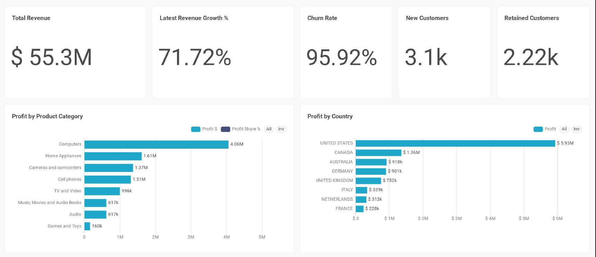
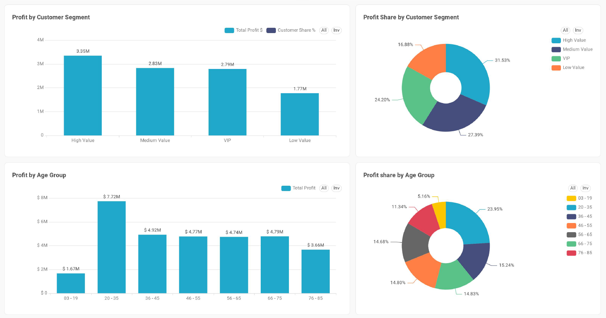
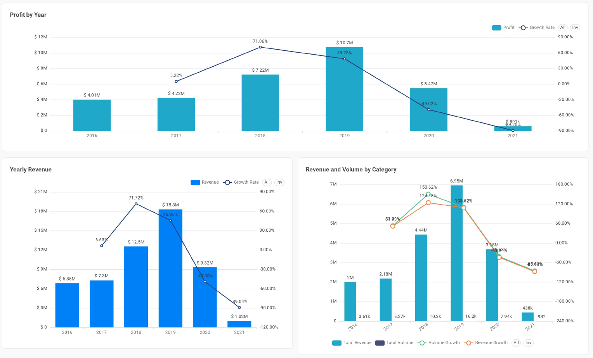
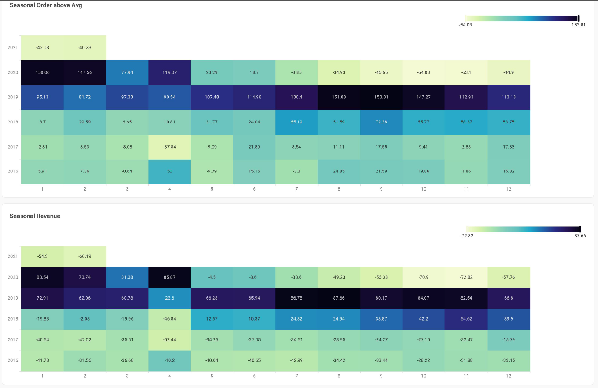
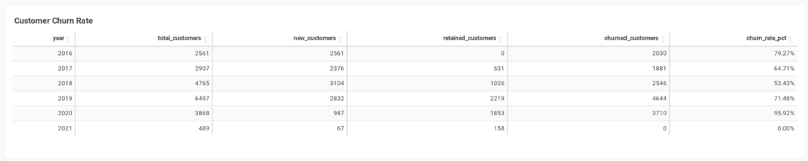

# Global Electronics Retailer

## Summary

Between 2016 and 2021, the business generated a total revenue of $55.3 million. The company experienced three consecutive years of strong growth, reaching its highest performance in 2019, before suffering a significant decline in 2020 due to the global COVID-19 pandemic. The downturn continued into 2021, resulting in a substantial reduction in both revenue and sales volume across all product categories.

Among all product categories, Computers was the most profitable, generating $4.06 million in profit and accounting for the largest share of total profits, followed by Home Appliances.

From a geographical perspective, the United States was the most profitable market, followed by Canada. Together, these two countries consistently generated more than $2 million in annual profit, with 2019 being the strongest year, producing more than $7 million in combined profit.

## 1. Growth Phase (2017–2019)

The period between 2017 and 2019 was characterized by rapid business expansion, driven by substantial increases in sales volume across most product categories.

Revenue increased from $7.30 million in 2017 to a peak of $18.31 million in 2019. The most significant year-over-year increase occurred in 2018, when revenue grew by 71.72%, representing the highest growth rate during the analysis period.

The primary contributors to this expansion were the Computers and Cell Phones categories, which reached peak sales volumes of 16,203 and 11,728 units, respectively, in 2019.

Although technology products generated the highest sales volumes, Games and Toys exhibited the fastest growth rate, increasing by 150.62% in 2018 and 109.62% in 2019, making it the fastest-growing category during the expansion period.

## 2. Early Warning Signs

Despite the overall positive business performance through 2019, several product categories began showing signs of slowing growth before the market-wide downturn.

* Home Appliances was the only major category to record negative growth in 2019, with sales volume declining by 2.69%, while most other categories continued to expand.
* Cameras and Camcorders experienced a significant decline of 27.10% in 2017. Although the category recovered during 2018 and 2019, it remained more volatile than other product segments.

These trends suggest that certain product categories were already experiencing market-specific challenges before the broader economic disruption.

## 3. Impact of the COVID-19 Pandemic (2020–2021)

The strong upward trend ended abruptly in 2020 as the COVID-19 pandemic disrupted consumer demand and business operations.

Revenue declined by 49.08%, falling from $18.31 million in 2019 to $9.32 million in 2020. This decline coincided with significant reductions in sales volume across the company's rapid growing product categories, including:

* Audio: −57.83%
* Computers: −50.99%
* Games and Toys: −46.58%

The downturn intensified in 2021, when revenue dropped by an additional 89.04%, reaching only $1.02 million. Every product category experienced severe declines in unit sales, with year-over-year decreases ranging from 87% to 91%, indicating a broad-based contraction across the business.

## Key Takeaways
* The business generated $55.3 million in revenue between 2016 and 2021.
* Revenue peaked at $18.31 million in 2019, following three years of sustained growth.
* The highest annual revenue growth (71.72%) occurred in 2018.
* Computers was the most profitable product category, generating $4.06 million in profit.
* The United States and Canada were the company's strongest-performing markets throughout the period.
* While overall business performance remained strong through 2019, some categories showed early signs of weakening demand.
* The COVID-19 pandemic triggered a sharp decline in 2020, followed by an even more severe contraction in 2021, affecting every product category.

---
## 🛠️ Tools & Technologies
- **Superset Apache**
- **Neon Console**
- **DBeaver**
- **PostgreSQL**
- **Power Query**
- **Excel / CSV Data Source**
- **GitHub** for version control and project sharing

---

## 📁 Dataset
Dataset Information  
The datasets used in this project were obtained from [Maven Analytics](https://mavenanalytics.io/data-playground/global-electronics-retailer).  

> *Note: The datasets are for educational purposes only.*

#### 📁 Global Electronics Retailer/

├── README.md                                 
├── dashboard/                                
│    └── KPIs.png                             
│    └── Profit_analysis.png                  
│    └── Profit_Revenue.png                   
│    └── Seasonality.png                      
│    └── Churn.png                            
├── sql/                                      
│    └── 01_table_column_renaming.sql         
│    └── 02_stages_tables.sql                 
│    └── 03_table_creation.sql                
│    └── 04_table_keys.sql                    
│    └── 05_schema.sql                        
│    └── 06_revenue_views.sql                 
│    └── 07_volume_views.sql                  
│    └── 08_profit_views.sql                  
│    └── 09_customer_views.sql                  
└── All CSV files on Maven Website            
  

## 👤 Author
**Dieudonné Nahimana**  
🌐 [LinkedIn Profile](https://www.linkedin.com/in/nahimana-dieudonn%C3%A9-99b4a9200/)
